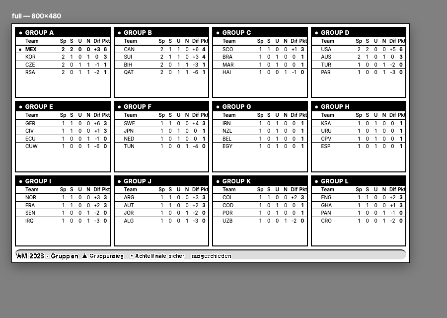
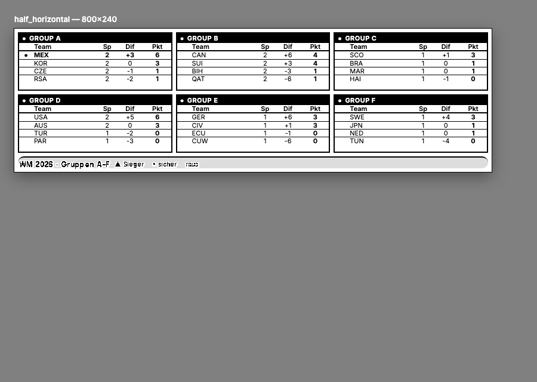
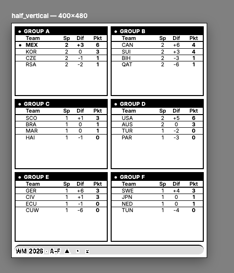
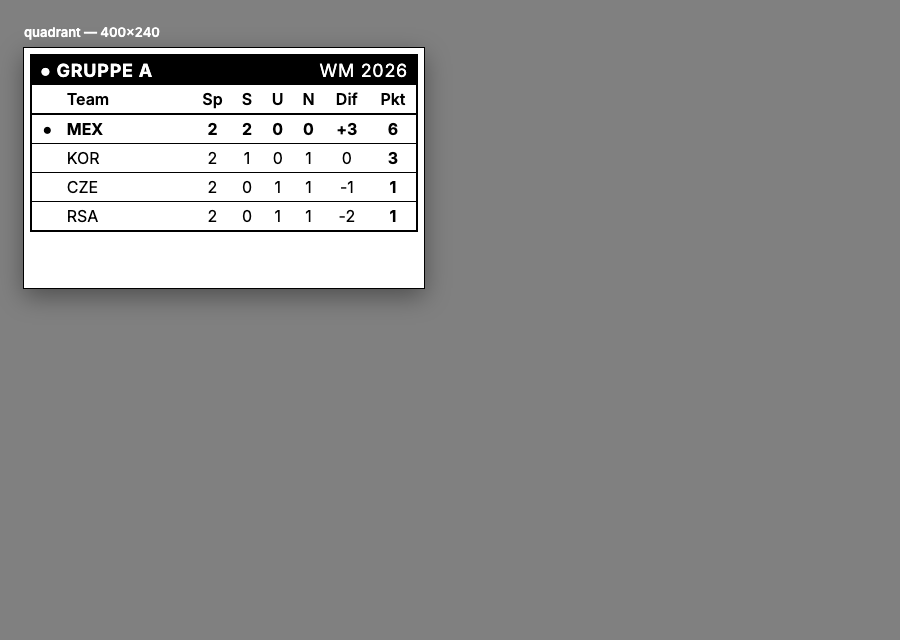

# TRMNL Private Plugin — FIFA WM 2026 Gruppenübersicht

Zeigt **alle 12 Gruppen (A–L)** der FIFA WM 2026 auf einem 800×480 E‑Ink‑Display
(1‑bit s/w). Jede Gruppe als kompakte Mini‑Tabelle:

```
Team | Sp | S | U | N | Tordiff | Punkte
```

* **Fett + ●** = Achtelfinale rechnerisch gesichert (Top‑2 sicher).
* **Fett + ▲** = Gruppensieg rechnerisch gesichert.
* **~~Durchgestrichen~~ + ✗** = rechnerisch ausgeschieden.



---

## 1. Datenquelle (verifiziert)

**Primär: `openfootball/worldcup.json`** (GitHub, raw JSON, **kein API‑Key**).

| Datei | URL |
|---|---|
| Spiele/Ergebnisse | `https://raw.githubusercontent.com/openfootball/worldcup.json/master/2026/worldcup.json` |
| Teams + Flaggen/Codes | `https://raw.githubusercontent.com/openfootball/worldcup.json/master/2026/worldcup.teams.json` |
| Gruppen­einteilung | `https://raw.githubusercontent.com/openfootball/worldcup.json/master/2026/worldcup.groups.json` |

### Verifizierter Feld‑Mapping (echter Testabruf)

`worldcup.json` → `{ "name": "World Cup 2026", "matches": [ … ] }`, 104 Matches
(72 Gruppenspiele + K.‑o.). Ein Match:

```json
{
  "round": "Matchday 1", "date": "2026-06-11", "group": "Group A",
  "team1": "Mexico", "team2": "South Africa",
  "score": { "ft": [2, 0], "ht": [1, 0] }
}
```

`worldcup.teams.json` → Liste von 48 Teams:

```json
{ "name": "Mexico", "fifa_code": "MEX", "flag_icon": "🇲🇽", "group": "A", "confed": "CONCACAF" }
```

**Wichtig:** Die Quelle liefert **nur Ergebnisse, KEINE fertigen Tabellen** – Punkte,
S/U/N, Tordifferenz werden hier selbst aus `score.ft` berechnet. Ein Spiel zählt als
*gespielt*, sobald `score.ft == [int, int]` vorliegt (sonst noch nicht gespielt).
Beim Abruf am 2026‑06‑19 waren 29/72 Gruppenspiele gespielt – alle 48 Teamnamen aus
`matches` matchen 1:1 die Namen in `teams.json` (Join geprüft, 0 Fehlstellen).

### Alternative für echte Live‑Stände: API‑Football

Wer minutengenaue Live‑Stände will, kann statt openfootball **API‑Football**
nutzen (kostenloser Key, `https://v3.football.api-sports.io`):

```
GET /standings?league=1&season=2026      # fertige Tabellen je Gruppe
GET /fixtures?league=1&season=2026        # Einzelspiele
```

`league=1` = FIFA World Cup. Liefert fertige `standings` (Pkt/S/U/N/Tordiff) – dann
entfällt die eigene Tabellenberechnung, aber die „sicher qualifiziert"-Logik aus
diesem Repo muss weiterhin selbst gerechnet werden. Mapping müsste an die
API‑Football‑Struktur angepasst werden (`response[].league.standings`).

---

## 2. Tabellenberechnung & Tiebreaker

Sortierung innerhalb der Gruppe (FIFA‑Reihenfolge), implementiert in
`src/standings.py`:

1. **Punkte**
2. **Tordifferenz**
3. **erzielte Tore**
4. **Direkter Vergleich** (Punkte, Tordiff, Tore *nur* aus den Spielen der
   punktgleichen Teams untereinander)
5. Fair Play — *Daten in der Quelle nicht vorhanden*
6. Losentscheid — *nicht automatisierbar*

Da Schritte 5/6 keine Datengrundlage haben, fällt die Sortierung nach Schritt 4
auf **alphabetisch** zurück (stabil, deterministisch). Dies ist im Code klar
markiert (`_alpha_tiebreak`).

Robustheit: alles 0 (noch kein Spiel) → korrekte 0‑Tabelle, alphabetisch.
Fehlende Felder (`fifa_code`, `flag_icon`) und Fremd‑/Tippfehler‑Teamnamen werden
defensiv abgefangen (Unit‑Tests in `tests/test_standings.py`).

---

## 3. „Sicher qualifiziert" / „ausgeschieden" — aktive Logik

> **Aktiv: `top2 + third-elim`.** Garantierte Top‑2 werden fett markiert,
> garantierte Gruppensieger zusätzlich mit ▲, rechnerisch Ausgeschiedene
> ausgegraut/durchgestrichen — **inklusive** korrekter Berücksichtigung der
> besten Gruppendritten bei der Ausscheidens‑Prüfung.

Berechnet wird per **Brute‑Force über alle möglichen Ausgänge der noch
ausstehenden Gruppenspiele** (je Spiel Sieg1/Remis/Sieg2 → max. 3⁶ = 729
Kombinationen pro Gruppe). Das ist für **Punkte exakt**; für Tiebreaker wird
bewusst der jeweils ungünstigste/günstigste Fall angenommen, damit eine Aussage
**nie zu Unrecht** „garantiert" lautet (lieber eine Runde zu spät fett als zu früh):

* **Top‑2 sicher (fett ●):** In *jedem* Szenario landet das Team auf Platz 1–2,
  selbst wenn es alle Punktgleichstände verliert (Worst‑Case‑Tiebreak). Da Top‑2
  immer weiterkommen, ist das eine echte Weiterkommens‑Garantie.
* **Gruppensieg sicher (▲):** In *jedem* Szenario Platz 1, selbst im
  Worst‑Case‑Tiebreak.
* **Ausgeschieden (durchgestrichen ✗):** Team kann in *keinem* Szenario Top‑2
  erreichen **und** seine maximal noch erreichbaren Punkte liegen unter der
  *garantierten Untergrenze* des 8.‑besten Gruppendritten der übrigen 11 Gruppen.
  Diese Untergrenze ist eine saubere (nie überschätzende) Schranke: pro Gruppe
  wird das über alle Szenarien *minimale* Punktekonto des Dritten bestimmt; das
  8.‑größte dieser garantierten Minima ist eine gültige Untergrenze für den
  8.‑besten Dritten. Liegt das Maximum eines Teams darunter, ist es sicher raus
  – auch über den Dritten‑Weg.

Damit ist sowohl die **Pflicht** (Top‑2 korrekt) als auch ein guter Teil der
**Kür** (Dritten‑Mathematik fürs Ausscheiden) erfüllt. Nicht beansprucht wird
„als bester Dritter bereits *sicher qualifiziert*" — eine gruppenübergreifende
*Garantie* nach oben ist per Brute‑Force nicht tragbar (3^(36) Kombinationen) und
würde Fehlaussagen riskieren; deshalb bleibt sie bewusst weg.

Getestet mit Szenarien in `tests/test_standings.py` (16 Checks: 0:0‑Start,
Clinch, Noch‑nicht‑sicher, Ausscheiden, GD/Direktvergleich, fehlende Felder).

---

## 4. Layouts

Alle vier TRMNL‑Layouts liegen in `markup/` und sind **reines Standard‑Liquid**
(lokal wie auf TRMNL identisch renderbar):

| Datei | Größe | Inhalt |
|---|---|---|
| `full.liquid` | 800×480 | alle 12 Gruppen (4×3), volle 7 Spalten |
| `half_horizontal.liquid` | 800×240 | Gruppen A–F (3×2) |
| `half_vertical.liquid` | 400×480 | Gruppen A–F (2×3) |
| `quadrant.liquid` | 400×240 | **eine konfigurierbare Lieblingsgruppe** |
| `shared.liquid` | — | gemeinsames CSS (→ TRMNL „Shared Markup") |

| half_horizontal | half_vertical | quadrant |
|---|---|---|
|  |  |  |

**Lieblingsgruppe** (quadrant): gesteuert über die Merge‑Variable
`favorite_group` (z. B. `"C"`). In TRMNL als **Custom Form Field** anlegen; die
Vorgabe aus dem Daten‑Payload dient als Fallback (sonst `A`).

**Design:** „Stadion‑Anzeigetafel" — schwarze Kopfzeilen, Tabellenlinien,
kräftige Inter‑Sans. Bewusst **keine** offiziellen FIFA‑/WM‑Logos. Teams werden
über den **FIFA‑3‑Buchstaben‑Code** (GER, BRA …) ausgewiesen — auf 1‑bit‑E‑Ink
zuverlässiger als Farb‑Flaggen‑Emoji (Emoji sind im Payload unter `flag` dennoch
verfügbar, falls gewünscht). Hervorhebung ausschließlich über Fettung und solide
schwarze Linien (Durchstreichen) — **kein Verlass auf Graustufen**.

---

## 5. Lokal bauen & rendern

```bash
python3 -m venv .venv && .venv/bin/pip install -r requirements.txt

# Tabellen + Qualifikationsflags berechnen → output/trmnl_data.json
.venv/bin/python src/build_data.py                      # live von openfootball
.venv/bin/python src/build_data.py --matches data/worldcup.json \
                                   --teams   data/worldcup.teams.json   # offline

# Vorschau aller 4 Layouts als HTML (je in echter Gerätegröße)
.venv/bin/python src/render_preview.py                  # → preview/*.html

# Tests
.venv/bin/python tests/test_standings.py
```

Optionen von `build_data.py`: `--favorite C` (Default‑Lieblingsgruppe),
`--out PFAD`, `--webhook URL` (siehe unten).

---

## 6. TRMNL‑Einrichtung

TRMNL kann die JSON‑Daten **nicht** direkt von openfootball ziehen (dort gibt es
keine fertigen Tabellen). Deshalb produziert `build_data.py` den fertigen Payload,
und TRMNL holt diesen per **Polling** ab. Empfohlener Weg:

### A) Polling (empfohlen)

1. `build_data.py` regelmäßig laufen lassen und das Ergebnis
   (`output/trmnl_data.json`) unter einer **öffentlichen URL** bereitstellen
   (GitHub Pages / Gist‑Raw / S3 / eigener Webspace). Beispiel mit GitHub Actions
   (alle 30 min):

   ```yaml
   # .github/workflows/build.yml
   on:
     schedule: [{ cron: "*/30 * * * *" }]
     workflow_dispatch:
   jobs:
     build:
       runs-on: ubuntu-latest
       steps:
         - uses: actions/checkout@v4
         - uses: actions/setup-python@v5
           with: { python-version: "3.12" }
         - run: pip install -r requirements.txt
         - run: python src/build_data.py --out docs/trmnl_data.json
         - uses: stefanzweifel/git-auto-commit-action@v5   # commit docs/ → Pages
   ```

2. In TRMNL: **Plugins → Private Plugin → New**.
3. **Strategy: `Polling`**, **Polling URL** = die öffentliche JSON‑URL.
4. **Markup‑Felder** befüllen:
   * **Shared Markup** ← Inhalt von `markup/shared.liquid`
   * **Full** ← `markup/full.liquid`
   * **Half Horizontal** ← `markup/half_horizontal.liquid`
   * **Half Vertical** ← `markup/half_vertical.liquid`
   * **Quadrant** ← `markup/quadrant.liquid`
5. (Optional) **Custom Form Field** `favorite_group` (Text, z. B. `C`) für die
   Lieblingsgruppe im Quadrant‑Layout.
6. Speichern → Live‑Preview prüfen → Plugin einer Playlist zuweisen.

Die im Polling‑Response enthaltenen Top‑Level‑Keys (`groups`, `favorite_group`,
`updated_at`, …) stehen im Liquid direkt als `{{ … }}` zur Verfügung.

### B) Webhook (Alternative)

`build_data.py --webhook https://trmnl.com/api/custom_plugins/<uuid>` schickt den
Payload als `{"merge_variables": …}` per POST. **Achtung:** Der volle 12‑Gruppen‑
Payload ist ~19 KB; das **Webhook‑Limit liegt bei 2 KB (TRMNL+: 5 KB)**. Für die
komplette Übersicht ist daher **Polling** die richtige Strategie. Der Webhook‑Weg
eignet sich nur für eine stark reduzierte Variante (z. B. nur die Lieblingsgruppe).

### Refresh‑Intervall

Gruppenspiele ändern sich nur im Minutentakt während Spielen, sonst gar nicht. Bei
openfootball (community‑gepflegt, nicht sekundengenau) ist ein **Refresh von
30–60 Minuten** sinnvoll und schont Batterie/Rate‑Limits. Während Spielphasen kann
auf 15 min verkürzt werden. (TRMNL‑Webhook erlaubt max. 12 Pushes/h, TRMNL+ 30/h.)

---

## 7. Projektstruktur

```
src/standings.py       Tabellen + Tiebreaker + Qualifikationslogik (pure, getestet)
src/build_data.py      Fetch → Berechnung → output/trmnl_data.json (+ --webhook)
src/render_preview.py  rendert die Liquid-Layouts lokal nach preview/*.html
markup/*.liquid        die 4 Layouts + shared.liquid (für TRMNL)
tests/test_standings.py 16 Logik-Checks
data/                  zwischengespeicherte openfootball-Rohdaten + TRMNL-Doku
output/trmnl_data.json fertiger Polling-/Webhook-Payload
preview/*.png|html     lokale Render-Vorschau
```

## 8. Bekannte Grenzen

* Fair‑Play/Los als Tiebreaker → alphabetischer Fallback (keine Quelle).
* `half_*`‑Layouts zeigen Gruppen **A–F**; für eine frei wählbare Einzelgruppe ist
  das **Quadrant**‑Layout (`favorite_group`) gedacht. Das `full`‑Layout zeigt alle 12.
* „Bester Dritter bereits *sicher qualifiziert*" wird (bewusst) nicht als Garantie
  ausgewiesen — nur die saubere Ausscheidens‑Schranke nutzt die Dritten‑Mathematik.
* openfootball ist community‑gepflegt; für offizielle Live‑Stände → API‑Football
  (Abschnitt 1).
